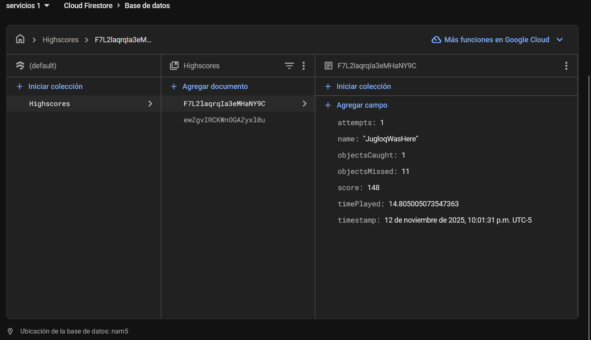

# 📘 Taller Servicios Camilo Duran

This project was developed in Unity as part of an academic exercise for the *Cloud Services Workshop*.  
It demonstrates the integration of **Firebase Firestore** with Unity for data persistence and leaderboard management.

---

## 🎮 Overview

A simple Unity-based interactive game where the player earns points over time and interacts with falling objects.  
When the game ends, results are uploaded to **Firebase Firestore**, where a leaderboard is automatically updated and displayed.

---

## 🧩 Core Features

- Real-time gameplay with score tracking.  
- Automatic upload of game results to Firebase Firestore.  
- Dynamic leaderboard display from the cloud.  
- Collection of analytical data such as playtime, attempts, and performance statistics.

---

## 🏆 Firebase Integration

The system stores each session in the Firestore collection **Highscores**, with the following fields:

Highscores
├── (document 1)
│ ├── name: "PlayerName"
│ ├── score: 1500
│ ├── timePlayed: 62.3
│ ├── date: "2025-11-12 18:42"
│ ├── attempts: 3
│ └── objectsCaught: 12
├── (document 2)
│ └── ...

### Example of Firestore Table  

---

## 🧠 Project Structure

ProjectName/
├── Assets/
│ ├── Prefabs/
│ ├── Scenes/
│ ├── Scripts/
│ │ ├── GameManager.cs
│ │ ├── PlayerController.cs
│ │ ├── FirebaseManager.cs
│ │ └── UIManager.cs
│ ├── UI/
├── Packages/
├── ProjectSettings/
└── README.md

---

## 📜 License

This project is intended for **educational purposes only**.  
You may reference or adapt it for academic or personal projects, as long as the original author is properly credited.
